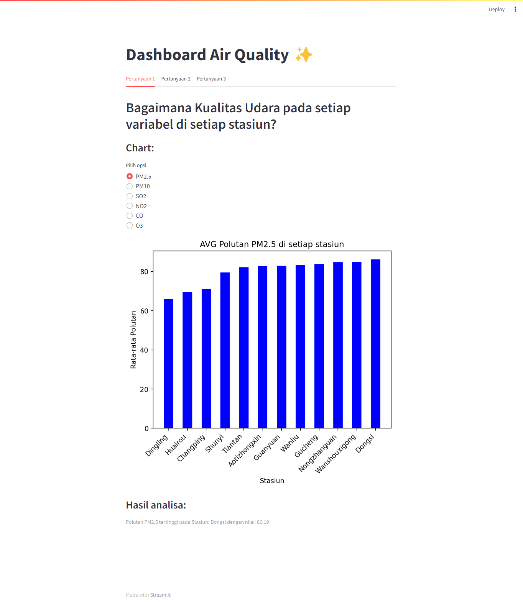
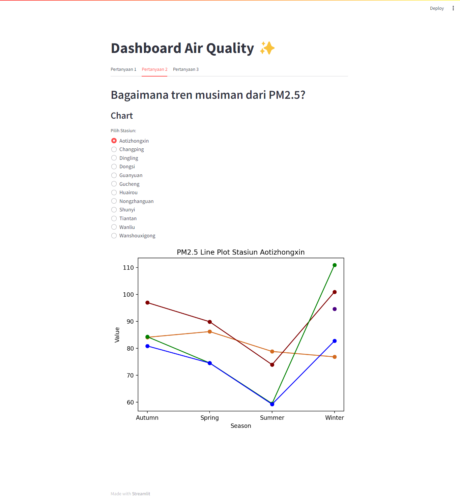
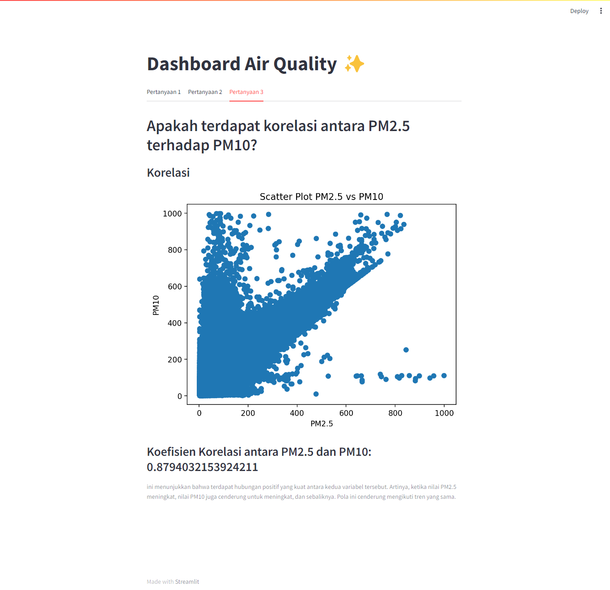

# Dicoding Submission Proyek Analisis Data - Air Quality in Station China
## Setup Installation
```
pip install -r requirements.txt
```
## Run steamlit app
```
cd dashboard
streamlit run dashboard.py
```
## Github Link
[https://github.com/ahrdadan/dicoding-subsmission-air-quality.git](https://github.com/ahrdadan/dicoding-subsmission-air-quality.git)

## Streamlit Link
[https://dicoding-subsmission-air-quality-tccqff7c4zujven3nw3w3x.streamlit.app/](https://dicoding-subsmission-air-quality-tccqff7c4zujven3nw3w3x.streamlit.app/)

## Screenshoots
### Pertanyaan 1

### Pertanyaan 2

### Pertanyaan 1

